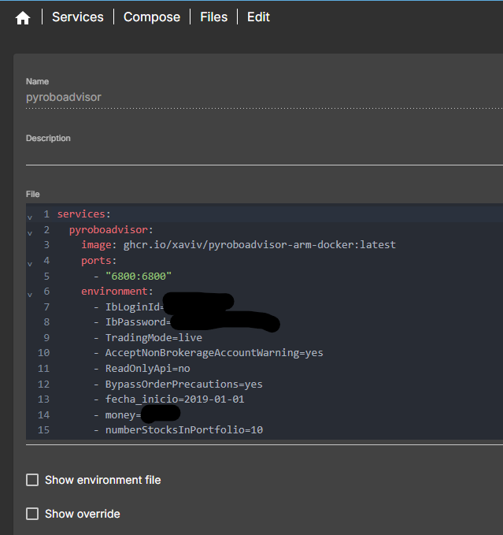
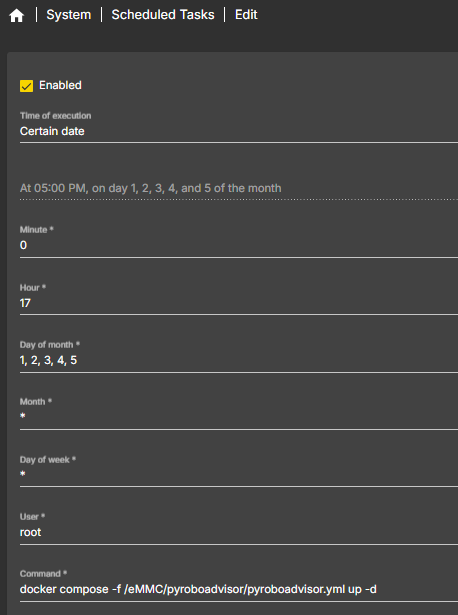

# Instrucciones usando openmediavault 7

En el menú Services / Compose / Files:

Usa el ejemplo de 

En el menú Schedule puedes programar el arranque diario:

Nota que el arranque debe ser mediante docker compose para que utilice la misma configuración que la definida en el docker compose file
